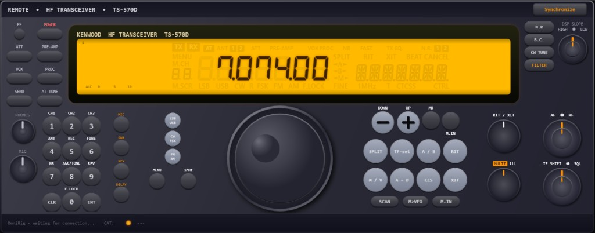

# ts570d_remote

**Disclaimer:** This repository is **vibe coded** (AI-assisted, exploratory hacking) and is **only an experiment**. It is not production software, not audited for safety or correctness, and not a substitute for the manufacturer’s tools or documentation.

---

## Project status / how to help

**IF YOU KNOW C#, WPF, AND XAML: IT WOULD BE GREAT IF YOU COULD HELP OUT — OR FORK THIS AND RUN WITH IT YOURSELF.** The goal is not to leave this as eye candy: this tool should be **actually useful** and **usable for real** in the shack.

**Where things stand:** the UI already “lands”, but from here on it needs **hands-on work** in the code. **XAML** is where AI assistance falls short (fine layouts, styles, alignment, keeping the front panel maintainable), so it helps to know the stack — or at least have patience for manual polish.

**CAT / OmniRig:** **a lot of functionality is still missing** or **not trustworthy / not finished**. Do not assume everything you see on screen is correctly wired to the rig.

**Network / true remote:** **there is no server yet** to put the radio on the network and drive it from another PC or from outside the house. Today this is **local control** (Windows + OmniRig per your setup), not a LAN/Internet remote-control product.

If this sounds like your thing: open an issue, send a PR, or fork and go.

---

## What it is

A Windows desktop remote-control style UI for the **Kenwood TS-570D** HF transceiver, built with **WPF** and **OmniRig** for CAT. Treat it as a learning toy, not a guaranteed rig-control solution.

## Requirements

- .NET (see `TS570_Remote/TS570_Remote.csproj` for target framework)
- OmniRig and appropriate rig configuration

## License

This project is released under the [MIT License](LICENSE).

**Safety:** Use at your own risk around real radios and RF equipment. The MIT License does not cover liability for how you operate hardware.
